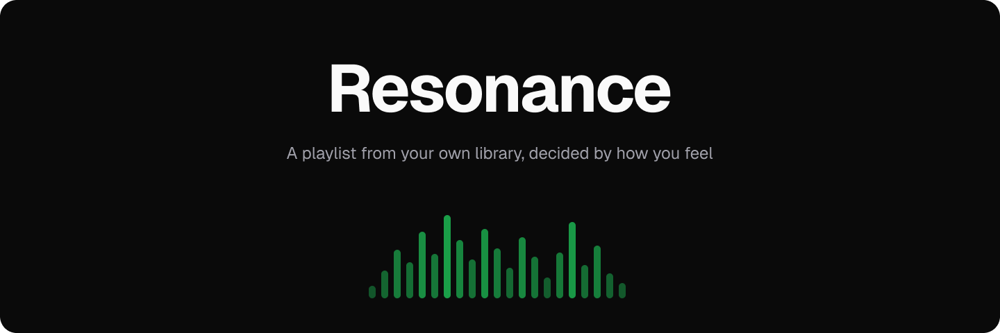
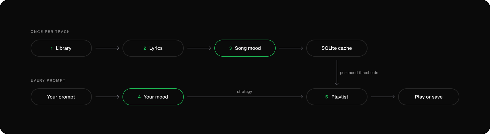
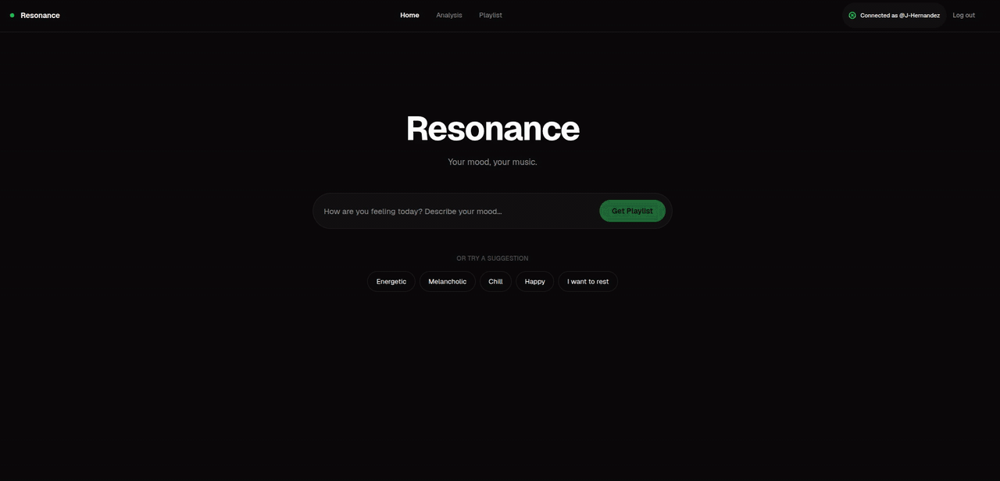

<p align="center">
  
</p>

# Resonance

<p align="center">
  <b>A playlist from your own library, decided by how you feel</b>
</p>
<p align="center">
  Describe your mood in plain words. Laya reads your songs, decides a strategy, and builds the playlist from music you already love.
</p>

<div align="center">

  
  
  
  

</div>

<br>

## &nbsp; The Problem
Mood playlists exist, but they are built from someone else's catalog, and the signals that used to make them possible are gone.

<table width="100%">
  <tr>
    <td width="33%" valign="top" align="center">
      <br>
      <h3 align="center">&nbsp; Not Your Music</h3>
      <p align="center">Mood playlists come from a global catalog. They rarely sound like the music you actually saved.</p>
      <br>
    </td>
    <td width="33%" valign="top" align="center">
      <br>
      <h3 align="center">&nbsp; No Audio Features</h3>
      <p align="center">Since late 2024, new Spotify apps get no audio features, no recommendations and no previews from the Web API.</p>
      <br>
    </td>
    <td width="33%" valign="top" align="center">
      <br>
      <h3 align="center">&nbsp; Words, Not Sliders</h3>
      <p align="center">People say "I'm sad but I want to feel better", not "valence 0.4, energy 0.6".</p>
      <br>
    </td>
  </tr>
</table>

<br>

## &nbsp; The Solution
Resonance treats it as a **decision problem**, not a recommendation problem. The mood of each song is read once from its **lyrics** and cached. Your prompt is interpreted at request time by [Laya](https://huggingface.co/convaiinnovations/laya), a non-autoregressive decision model that answers typed questions with calibrated probabilities. Ranking is plain math over those cached decisions, so a new prompt takes seconds instead of re-reading your whole library.

### How it works
<p align="center">
  
</p>


1.  **Library:** you sign in with Spotify. Resonance reads your own and collaborative playlists and merges their tracks without duplicates. Playlists it created itself are always skipped.
2.  **Lyrics:** each track's lyrics are fetched from [LRCLIB](https://lrclib.net) and stored in SQLite, with retries and backoff when the service is busy. This happens once per track.
3.  **Song mood:** Laya reads the full lyrics and answers two questions: which of 7 moods fits (love, happiness, comfort, sadness, loneliness, anger, fear) and whether the song is positive or negative. The full probability distribution is cached per track.
4.  **Your mood:** Laya reads your prompt and decides the signals (feels down, wants a change, wants energy, wants rest), the emotion, the situation and the strategy: *keep me company*, *lift me up*, *energize* or *calm*.
5.  **Playlist:** every song is checked against your target mood with a per-mood probability threshold, fitted on 300 user-labeled tracks (love 72%, happiness 8%, comfort 18%, sadness 14%, loneliness 16%, anger 50%; fear has no reliable threshold and instead requires the song's top mood to be fear). Qualifying songs are ordered by that probability, highest first. *Lift me up* builds a three-step progression, each step targeting a different mood (your detected mood, then comfort, then happiness).

> Laya never picks songs directly. It interprets text into structured decisions, and those decisions choose the songs. Every step shown on screen is a real model output.

<br>

## &nbsp; Demo
<p align="center">
  
</p>

<br>

## &nbsp; What We Measured

Song mood from lyrics is hard, so every design choice was tested on a labeled set before shipping.

| **Measure**                                   | **Resonance**      | **Reference**                   |
| :-------------------------------------------- | :----------------: | :------------------------------ |
| 7-mood choice, strict (300 user-labeled)      | 31%                |                                 |
| 7-mood choice, lenient (adjacent mood counts) | 55%                |                                 |
| Positive vs negative (300 user-labeled)       | 45-52%             | 50% (chance)                    |
| Playlist precision, held-out split            | 48%                | 32% (random selection)          |
| Playlist recall, held-out split               | 33%                |                                 |
| [MERGE lyrics benchmark](https://arxiv.org/abs/2407.06060), 4 quadrants | 57.5% (macro-F1 0.57) | 0.71-0.75 macro-F1 (trained models) |

On MERGE, the 7 moods are mapped onto the same 4 circumplex quadrants used there; the reference models were trained directly on that benchmark, Laya was not.

Because the model's polarity read and single argmax mood aren't reliable enough on their own, playlist selection instead uses the full per-mood probability distribution against per-mood thresholds fitted on that 300-track set (precision-first: maximize F0.5 subject to precision beating a random baseline by at least 0.15 and recall staying at or above 0.20). Measured on a held-out split, that reaches 48% average precision against a 32% random baseline, at 33% average recall. `scripts/eval_mood.py` re-runs the evaluation against your own labels.

<br>

## &nbsp; Tech Stack
A hexagonal Python backend and a small React app. The only model in the loop is Laya, running locally on CPU.

| **Component**      | **Technology**                                                                                             | **Description**                                                                                  |
| :----------------- | :--------------------------------------------------------------------------------------------------------- | :----------------------------------------------------------------------------------------------- |
| **Backend**        |                          | FastAPI with ports and adapters. SQLite caches lyrics, mood profiles and sessions.               |
| **Frontend**       |                                  | React and TypeScript with plain CSS. Animated analysis screen and a custom player.              |
| **Decision model** |        | [Laya](https://huggingface.co/convaiinnovations/laya) multilingual checkpoint, batched with `predict_batch`. |
| **Lyrics**         |   | [LRCLIB](https://lrclib.net), free and open, no API key.                                         |
| **Spotify**        |                                        | OAuth with PKCE, playlist reading and saving, full-track playback via the Web Playback SDK.      |

<br>

## &nbsp; Getting Started

### Requirements

- Python 3.11+ with [uv](https://docs.astral.sh/uv/), and Node.js with npm
- A **Spotify Premium** account (the Web Playback SDK requires it)
- A Spotify app from the [developer dashboard](https://developer.spotify.com/dashboard) with this redirect URI:
  ```
  http://127.0.0.1:8000/auth/callback
  ```

### Run it

1. **Install:** creates `backend/.env` and `frontend/.env`, then installs dependencies (`uv sync`, `npm install`). Fill in `SPOTIFY_CLIENT_ID` and `SPOTIFY_CLIENT_SECRET` in `backend/.env`.
   ```bash
   make install
   ```
   The backend pulls PyTorch through `laya`, so the first install takes a few minutes. Laya's weights download from Hugging Face on first use. No GPU needed.
2. **Run:** starts the API and the web app together.
   ```bash
   make dev
   ```
3. **Open** [http://127.0.0.1:5173](http://127.0.0.1:5173) and connect Spotify. Use `127.0.0.1`, not `localhost`: the session cookie and the Spotify redirect are bound to it.

### Try it on a few playlists first

Create `backend/playlists.local.json` to limit the library to some playlists. The file is gitignored, and names match ignoring case and accents.

```json
{
  "playlist_allowlist": ["Road Trip", "Late Night", "Particula"]
}
```

Delete the file to use every playlist you own or collaborate on.

### Tests

```bash
make test        # unit tests, no network, no model
make test-laya   # integration tests against the real Laya model
```

Run `make` to list every command.

<br>

## &nbsp; Roadmap
- [x] **Spotify sign-in** with PKCE, own and collaborative playlists only
- [x] **Lyrics cache** from LRCLIB with retries, backoff and resumable downloads
- [x] **Song mood profiles** with a full 7-mood distribution per track
- [x] **Prompt decisions** for signals, emotion, situation and strategy
- [x] **Per-mood thresholds** and a *lift me up* progression
- [x] **Animated analysis** that reveals chosen and rejected songs
- [x] **Full-track player** and **Save to Spotify**
- [ ] **Human-labeled evaluation set** in Spanish and English
- [ ] **Better situation detection** for short prompts like "I want popcorn"
- [ ] **GPU or distilled model** to profile large libraries faster
- [ ] **Instrumental tracks**, which have no lyrics to read today

<br>

## &nbsp; Community
- [Contributing](docs/CONTRIBUTING.md)
- [Commit convention](docs/commits-convention.md)
- [Code of conduct](docs/CODE_OF_CONDUCT.md)
- [Security policy](docs/SECURITY.md)

<br>

## &nbsp; Acknowledgements
- [Laya](https://huggingface.co/convaiinnovations/laya) by Convai Innovations: the decision model behind every choice
- [LRCLIB](https://lrclib.net): open lyrics that make this possible without scraping
- [Spotify Web API and Web Playback SDK](https://developer.spotify.com/documentation): playlists, saving and playback

<br>

> [!IMPORTANT]
> The first run can take several minutes. Resonance downloads the lyrics of every song in your library and reads their mood with Laya on your CPU. Everything is cached in SQLite, so later runs only process new songs.

<br>

## &nbsp; License
Released under the [GPL-3.0](LICENSE) license.
